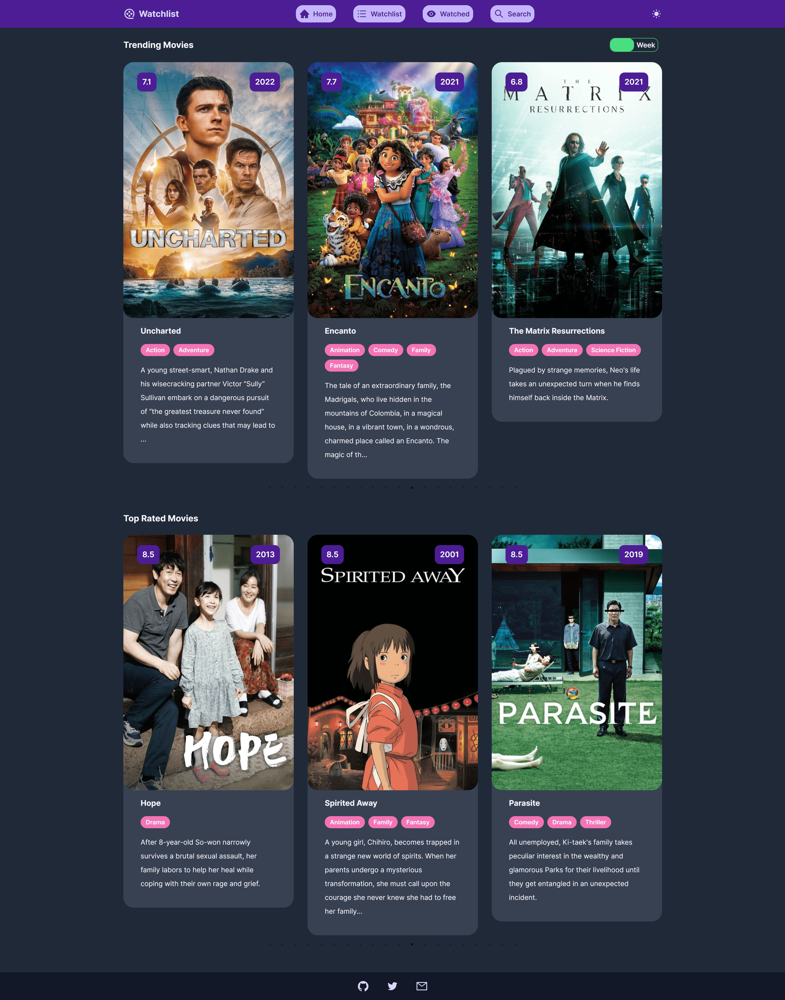
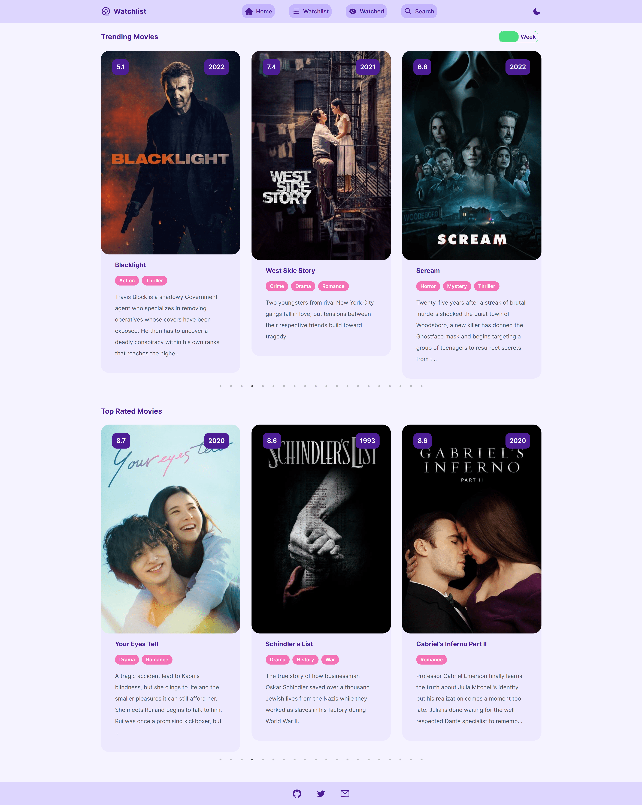
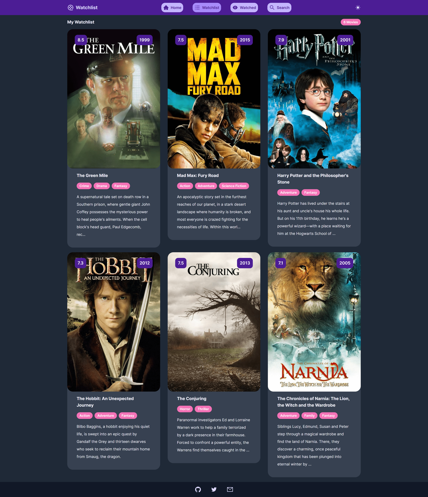
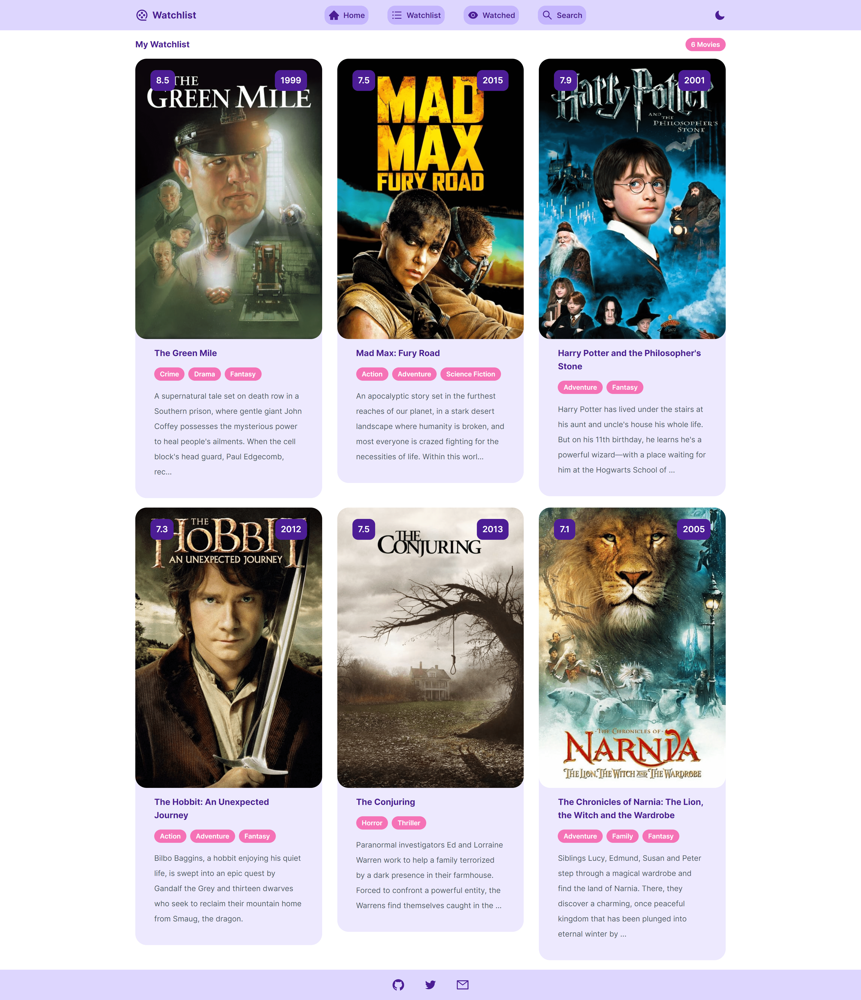
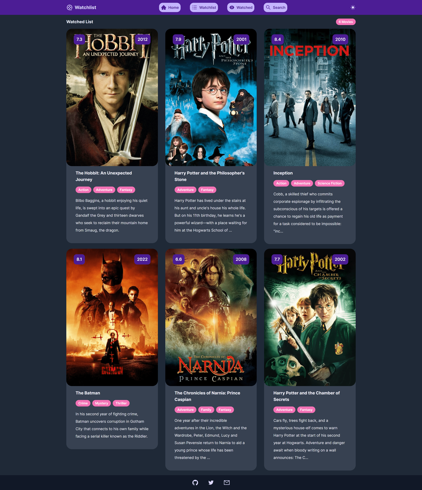
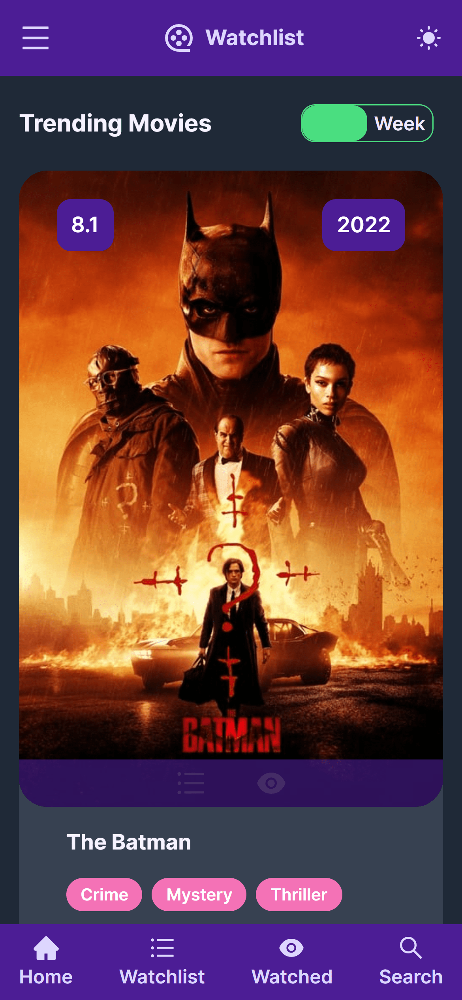
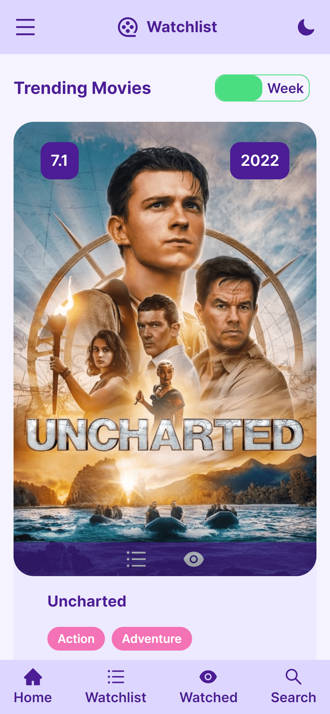
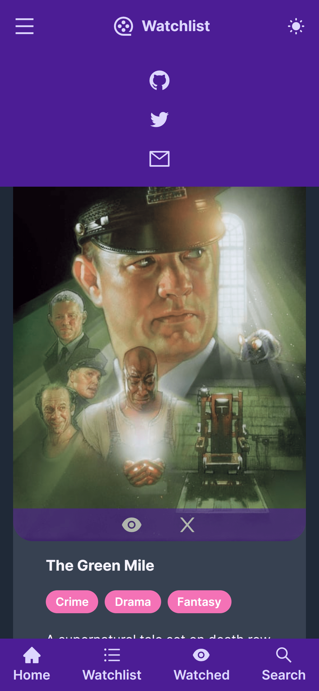
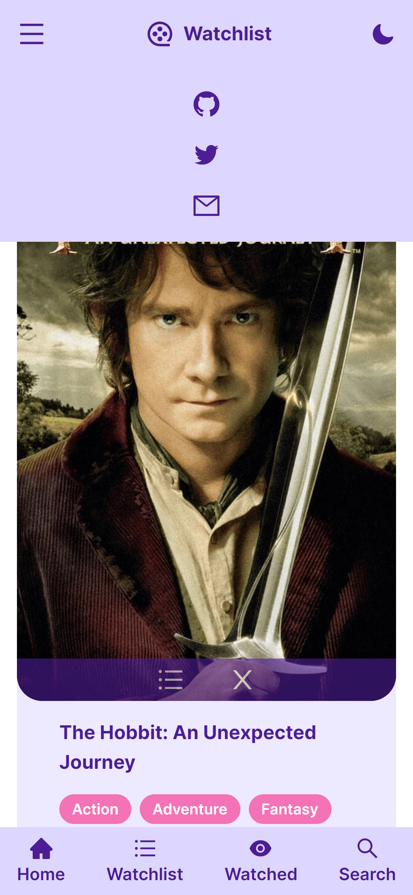

# 🎥 Watchlist

Discover new movies and add them to your watchlist or watched list.

## Home

On the homepage, you can see what's trending daily or weekly, as well as the top-rated movies, and you can add the movies you wish to watch to your watchlist or watched list. All lists are saved into browser's local storage.

<table style="padding:10px">
  <tr> 
    <td></td>
    <td></td>
  </tr>
</table>

## Watchlist

You can delete the movies you have added to your watchlist or send them to your watched movies list.

<table style="padding:10px">
  <tr> 
    <td></td>
    <td></td>
  </tr>
</table>

## Watched

You can remove the movies you watched from the list or move them to the watchlist.

<table style="padding:10px">
  <tr> 
    <td></td>
    <td></td>
  </tr>
</table>

## Search

By searching, you can add movies to the lists you want.

<table style="padding:10px">
  <tr> 
    <td></td>
    <td></td>
  </tr>
</table>

<table style="padding:10px">
  <tr> 
    <td></td>
    <td></td>
    <td></td>
    <td></td>
  </tr>
</table>

## ✨ About The Project

The project was developed with React.js by using Context API and React Hooks, styled with Tailwind CSS.

### Tech Stack

- [**React**](https://reactjs.org/)
- [**Tailwind CSS**](https://tailwindcss.com/)
- [**Netlify**](https://www.netlify.com/)

### Library

- [**React Router**](https://reactrouter.com/)
- [**React Icons**](https://react-icons.github.io/react-icons)
- [**React Slick**](https://www.npmjs.com/package/react-slick)

### API

- [**TMDB API**](https://www.themoviedb.org/documentation/api)

## ⚡ Getting Started

These instructions will get you a copy of the project up and running on your local machine for development and testing
purposes.

### Prerequisites

The project can be built with npm or yarn, so choose one of the approach bellow in case you don't have any installed on your system.

- npm is distributed with Node.js which means that when you download Node.js,
  you automatically get npm installed on your computer. [Download Node.js](https://nodejs.org/en/download/)

or

- Yarn is a package manager built by Facebook Team and seems to be faster than npm in general. [Download Yarn](https://yarnpkg.com/getting-started)

### Installing

To download the project follow the instructions bellow

```
git clone https://github.com/fundakartal/watchlist-react
cd watchlist-react
```

Sign up to [TMDB](https://www.themoviedb.org/) with your e-mail and [get the API key](https://www.themoviedb.org/settings/api)
Create a file at the root of the project called .env.local with the following contents:

```sh
REACT_APP_TMDB_KEY=YOUR API KEY HERE
```

Install dependencies and run with:

npm

```
npm install
npm start
```

or

yarn

```
yarn install
yarn start
```

## 📬 Contact

[](https://twitter.com/fundakartaI)
[](mailto:kartalfunda01@gmail.com)

## ⭐️ Show Your Support

Please give a ⭐️ if this project helped you!
